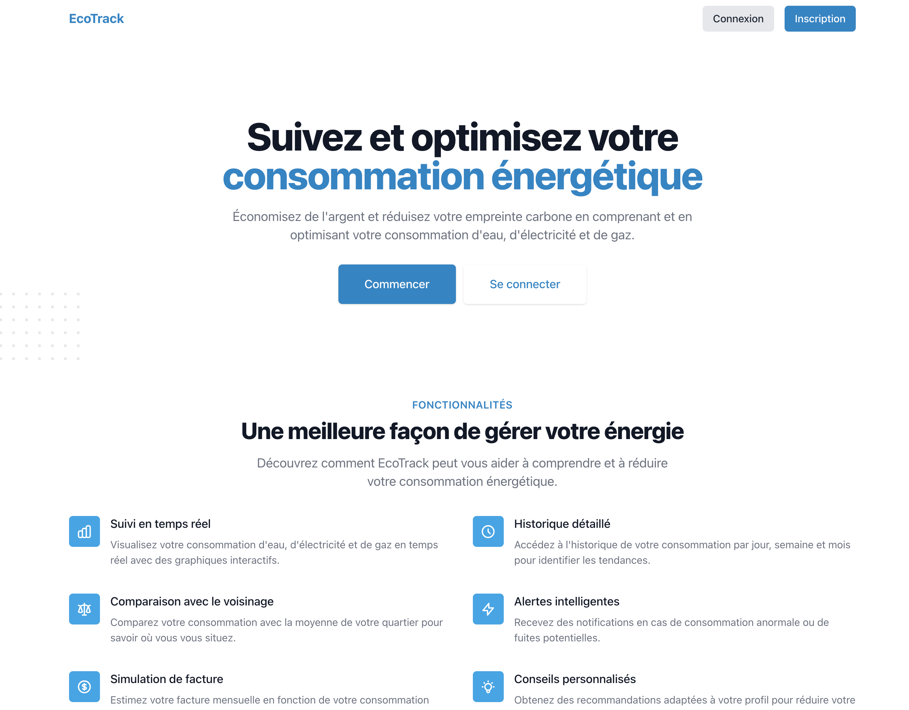
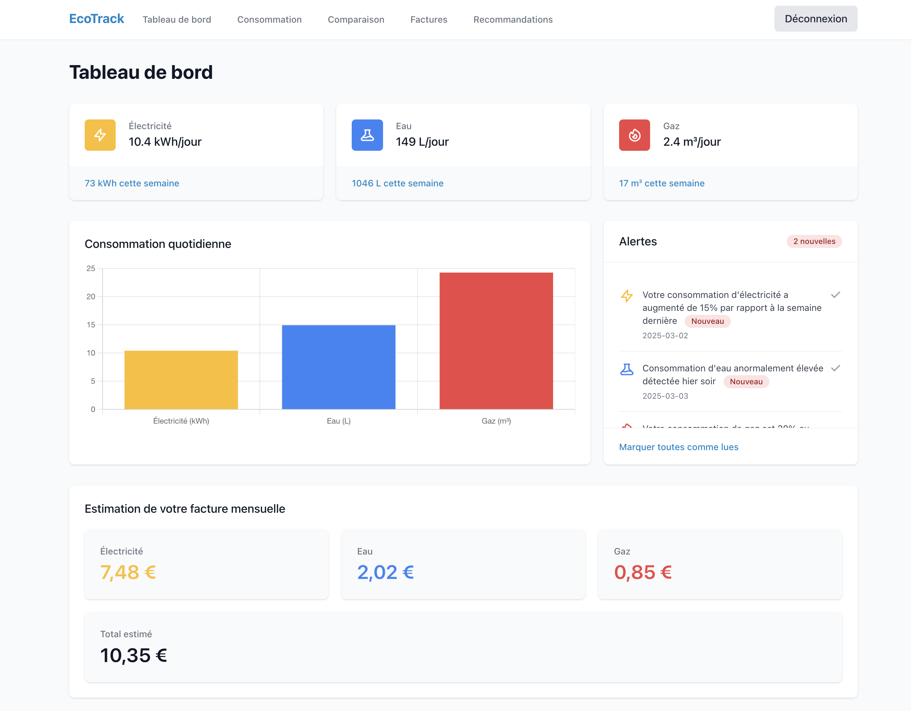
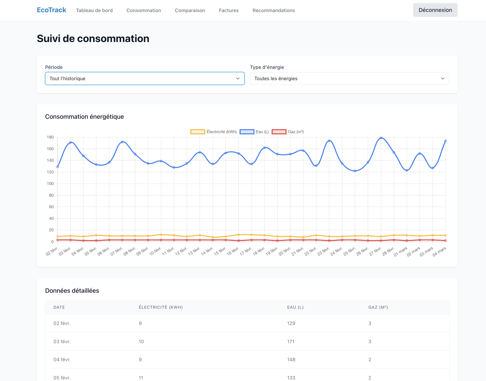
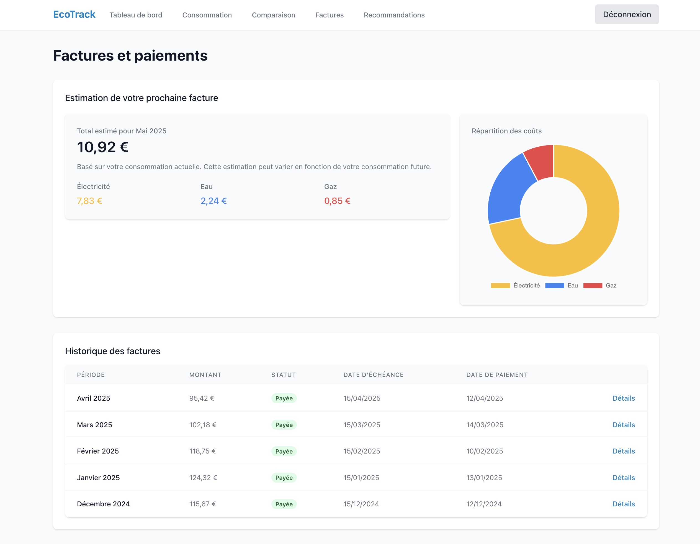

# 🌍 Tableau de Bord de Consommation Énergétique

Ce projet est une application web permettant aux utilisateurs de suivre et d'optimiser leur consommation énergétique (électricité, eau, gaz) en temps réel à l'aide d'un tableau de bord interactif.

## 🚀 Fonctionnalités principales

- **Tableau de bord interactif** avec visualisation des données
- **Graphiques** de consommation par jour, semaine et mois
- **Alertes** en cas de surconsommation
- **Estimation de la facture** mensuelle
- **Suivi détaillé** de la consommation par type d'énergie (électricité, eau, gaz)
- **Estimation de facture et historique** des paiements

## 🎨 Technologies utilisées

- **Frontend** : Vue.js, TailwindCSS, Chart.js
- **Backend** : (Non implémenté pour ce projet, mais un backend Node.js avec Express/NestJS serait recommandé)
- **Base de données** : (Non implémenté, mais PostgreSQL ou Firebase sont suggérés)
- **Authentification** : Firebase Auth ou OAuth (Google, Email/Mot de passe)

Captures d'écran des pages importantes :

1. **Page d'accueil**  
   

2. **Tableau de bord principal**  
   

    - Vue détaillée de la consommation d'électricité, d'eau et de gaz
    - Graphiques interactifs montrant la consommation quotidienne
    - Alertes en cas de surconsommation
    - Estimation mensuelle de la facture
    - Suivi détaillé par jour, semaine ou mois
    - Filtrage par type d'énergie
    - Alertes en cas de surconsommation
    - Estimation de la facture mensuelle
   
2. **Suivi de consommation**  
   
    - Visualisation détaillée de la consommation par jour, semaine ou mois
    - Filtrage par type d'énergie (électricité, eau, gaz)
    - Tableau de données détaillées

2. **Factures et paiements**  
   
    - Estimation détaillée de la prochaine facture
    - Répartition des coûts par type d'énergie
    - Historique des factures précédentes
    - Gestion des moyens de paiement

###  Installation & Setup
1️⃣ **Clone the repository**  
```sh
git clone https://github.com/gaelWumba/ecotrack  

npm install  
npm run dev  


